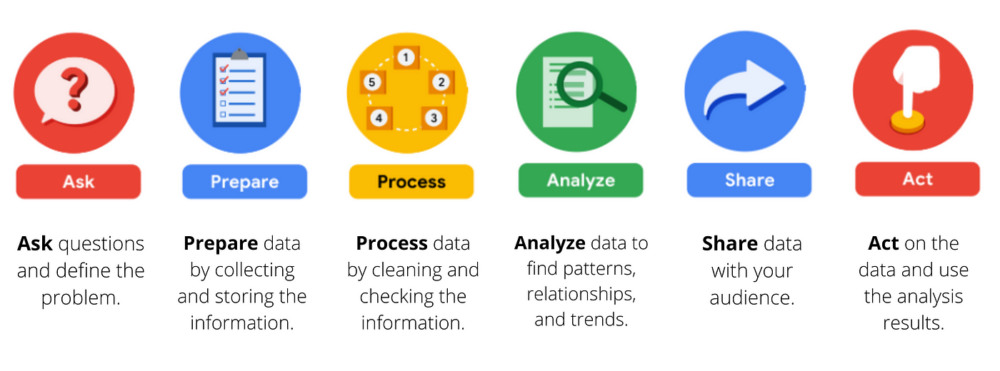
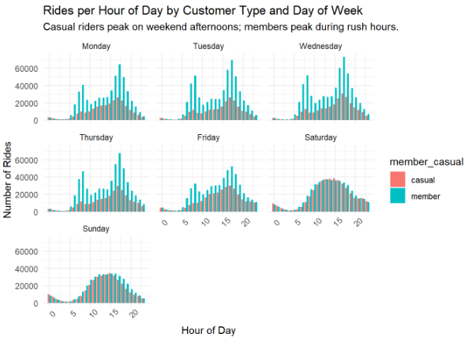
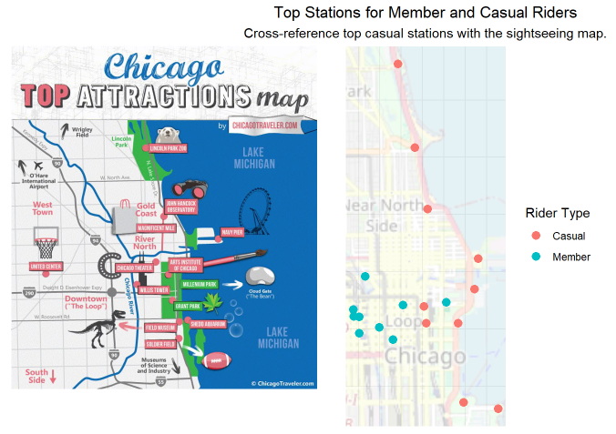
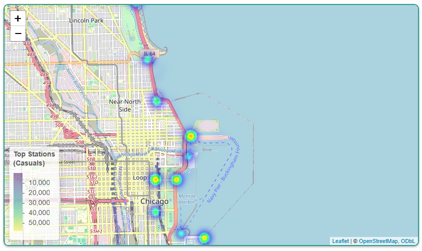
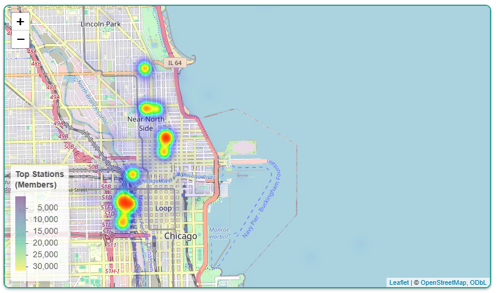
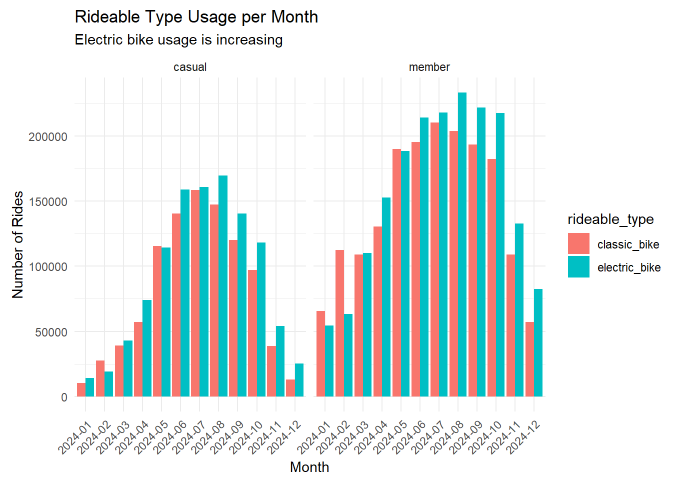
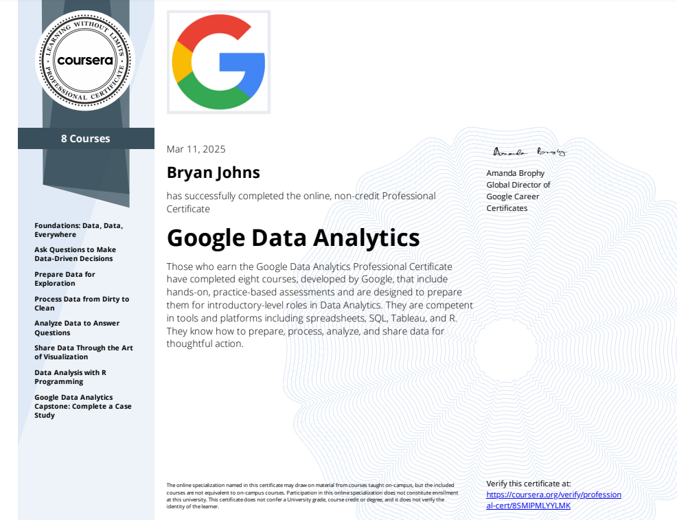

# Cyclistic-A-Google-Data-Analytics-Capstone
Data Analysis of a fictional bicycle rideshare company business task, Cyclistic, for the Google Data Analytics Capstone

- [Description](#description)
- [Usage](#usage)
- [Gallery](#gallery)
- [Certificate](#certificate)
- [References](#references)
- [Licenses](#licenses)
- [Acknowledgements](#acknowledgements)
- [Author](#author)

## Description

A hypothetical data analysis project, answering a business question for a fictional bikeshare company, analyzing customer behavior and concluding with recommendations to assist in converting casual customers into annual members. Analysis covered the years 2024 and 2019. The top three recommendations are provided.

This mock business task was completed as the capstone project for [Data Analytics Professional Certificate](https://www.coursera.org/professional-certificates/google-data-analytics).

## Usage

Final documentaion is posted on the web, knitted from R Markdown into HTML.

The final report can be found [here](https://johbry17.github.io/Cyclistic-A-Google-Data-Analytics-Capstone/summary_2024.html), for 2024. Also included is analysis for 2019, located [here](https://johbry17.github.io/Cyclistic-A-Google-Data-Analytics-Capstone/summary_2019.html).

2024's exploratory data analysis is posted [here](https://johbry17.github.io/Cyclistic-A-Google-Data-Analytics-Capstone/scratch_pad_2024.html). 2019's can be found [here](https://johbry17.github.io/Cyclistic-A-Google-Data-Analytics-Capstone/scratch_pad_2019.html).

Steps for data cleaning can be found in the [resources](https://github.com/johbry17/Cyclistic-A-Google-Data-Analytics-Capstone/tree/main/resources) folder. Google provided a template, `data_cleaning_v1.R`. `data_cleaning_v2.R` processed data for 2019, and `data_cleaning_v3.R` cleaned 2024. To clean the same data and use the above exploratory data analyses, download the data from the [source](https://divvy-tripdata.s3.amazonaws.com/index.html).

## Gallery

## Certificate

## References

Divvy and Lyft provided the [data](https://divvy-tripdata.s3.amazonaws.com/index.html) to Google and Coursera.

## Licenses

MIT License, copyright 2025, Bryan Johns.

The [data](https://divvy-tripdata.s3.amazonaws.com/index.html) has been made available by Motivate International Inc. under this [license](https://divvybikes.com/data-license-agreement).

## Acknowledgements

Thanks to Coursera and the team at Google that put this together, and to Google, Lyft, Divvy, and Motivate International Inc. for making the data available.

## Author

Bryan Johns, March 2025

*AI generated mock logo*